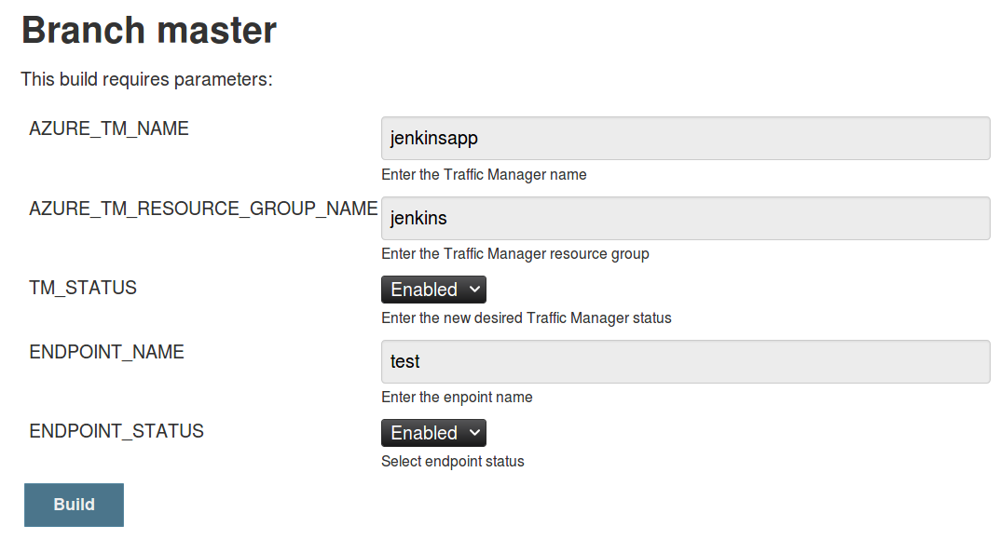

# Azure Traffic Manager Pipeline Script

## Description

This script was create to manage an Azure Traffic Manager using the Jenkin's Blue Ocean plug-iin.   The idea is to be able to enable/disable the TM, but also to add/remove endpoints.

## Requirements

- Jenkins
- Jenkins Blue Ocean Plug-In
- Jenkins Parameter-Trigger
- Jenkins Azure Crendentials Plug-In

## Setup

1. Install the required plug-ins.
1. Create an [Azure Service Principal](https://docs.microsoft.com/en-us/azure/azure-resource-manager/resource-group-create-service-principal-portal#get-application-id-and-authentication-key) for the pipeline.
1. Add the Azure Service Principal creds to the Jenkins Azure Service Principal creds and test it works.
1. Create the Azure Traffic Manager
1. Create the app that will be used as an endpoint (optional)
1. Create a Blue Ocean pipeline.
1. Add the content of the Jenkinsfile here in your pipeline.

## Execution

1. Using the Jenkins  classic view, launch the parameterized build. (do not using BO as of now it only shows one parameter)

2. Enter the parameters

3. Watch the pipeline do its job.

